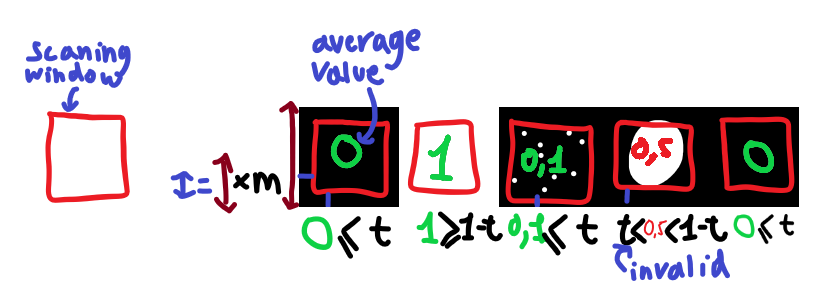

# Rectangle detection

This code will be used to find rectangles/squares in an image and eventually to read data

## Improvements

Make it support reading non-rotated rectangles

## Square deformer (rectangle_deformer.py)

This script takes in the original image and the list of corner coordinates.

- As a first step, it orders the corners in a clockwise fashion. This block of code to do this seems over-engineered, but it it's necessary because no assumptions are being made about the orignial quardilateral, notably on the rotation of the entire shape as well as the angles of the sides.
- After this, it uses openCV2 methods to warp the quadrilateral's corners on to a perfect 100x100px square for further processing.

## Square decoder (square_decoder.py)

This script takes in a square picture and reads data from it in regular intervals defined by the following drawing:

*m is the CHUNK_MARGIN (a %) t is the DECODE_TOLLERANCE (a %)*

Data is then returned as a 2D array of 0s and 1s (0 is black 1 is white).
